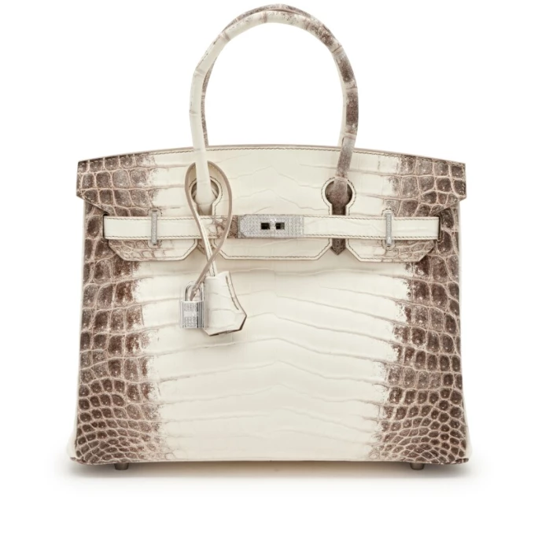
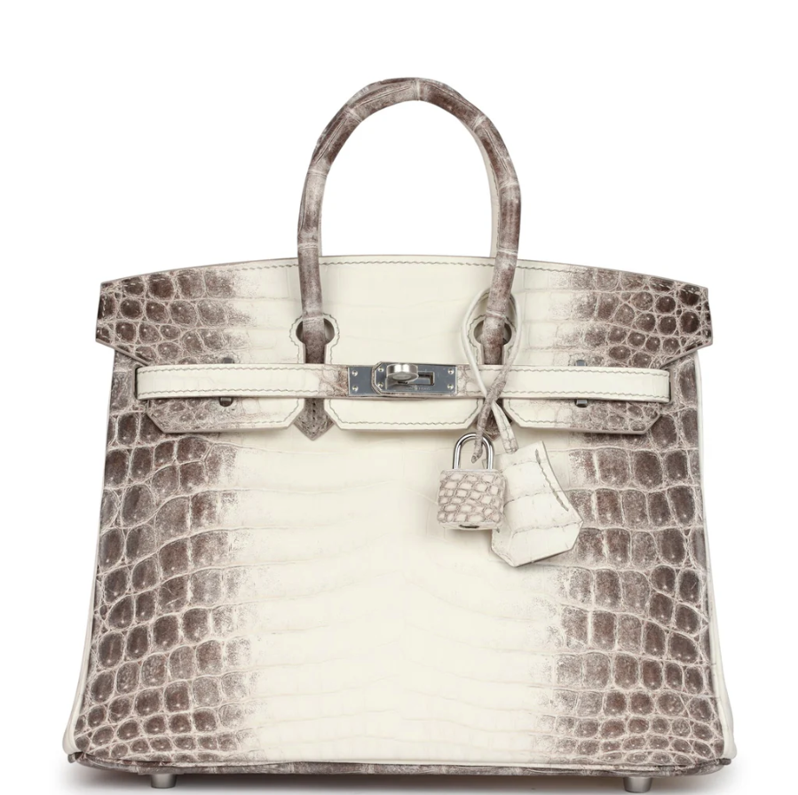
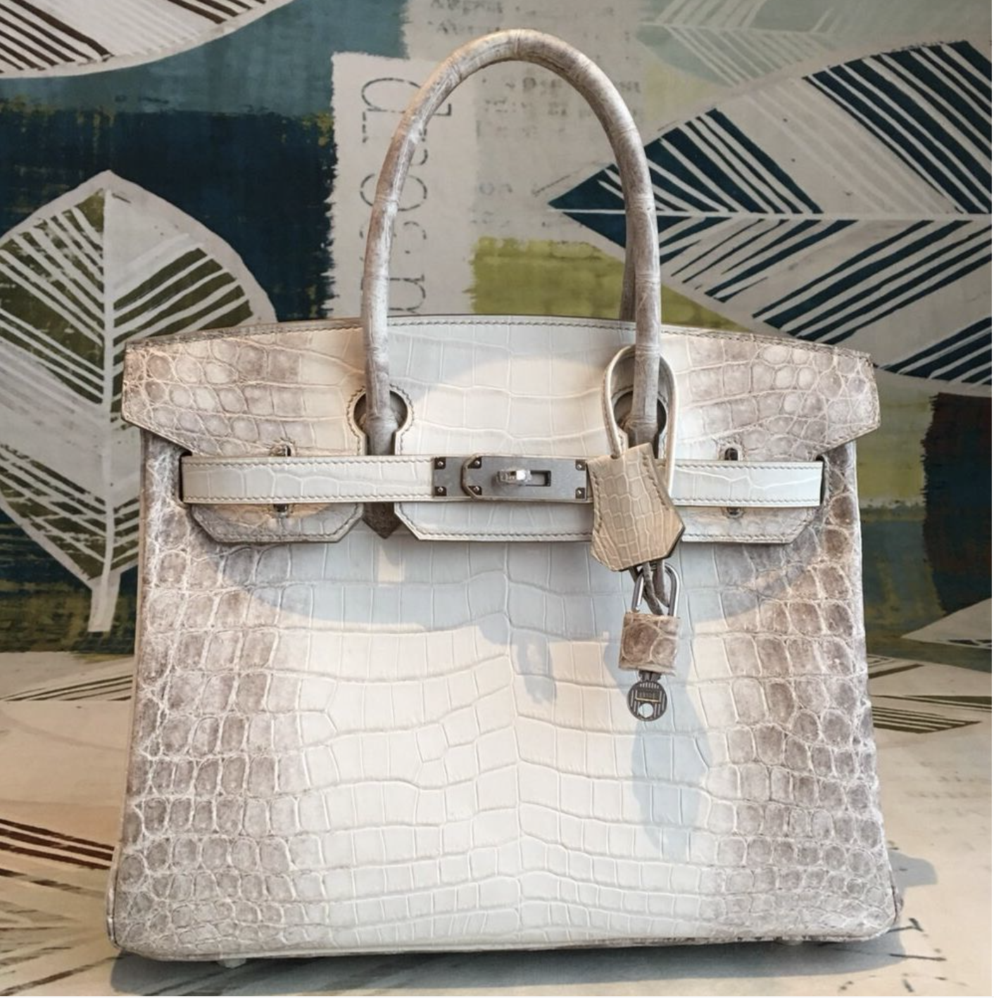
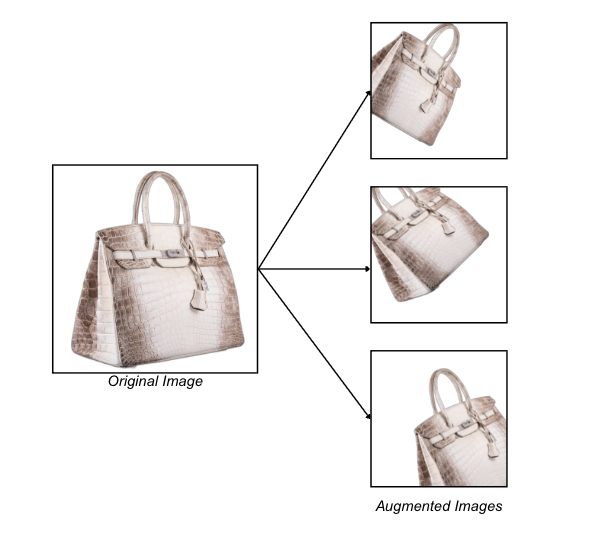

# Dupe Detection: Can a ML model spot the fake? 

In 2019, The RealReal -- an “authenticated luxury resale” marketplace -- sold a fake Dior bag to [Forbes contributor](https://www.forbes.com/sites/richardkestenbaum/2019/10/23/if-fake-bags-are-being-sold-on-the-realreal-how-can-the-resale-business-ever-succeed/) Richard Kestenbaum for $3,600 USD. Kestenbaum consulted experts who spotted the tells: the herringbone pattern was slightly off; the handles were a hair too short; the embroidery wasn’t as detailed as it should be. 

When contacted about the legitimacy of the bag, The RealReal said they were not able to definitively confirm, claiming that authenticating is both “an art and a science.” Further, when asked about the quality of TRR’s internal authentication process, inside sources said that authenticators did “as good a job as any human can.” 

Being both a data scientist and a fashion lover, these comments made me question authentication processes that rely entirely on human judgement. In his article, Kestenbaum also points out that the average customer doesn’t have access to trained authenticity experts. If there is a scientific element to authenticating, if human error is a concern, and if there is an accessibility gap in authentication services, why not turn to machine learning? With the right data and models, an algorithmic approach could make luxury authentication more consistent, scalable, and accessible. 

As a proof-of-concept approach, I wanted to train a binary image classification model to identify real versus fake versions of a single designer bag. I chose to limit the scope to one style because signs might be bag-specific -- like the embroidery in the fake Dior sold by The RealReal.

## The bag 

When it came to the bag, I knew immediately which one I wanted to investigate: the Hermès Birkin. A universal symbol of wealth and exclusivity, Birkins start at $10,000 USD -- and you can’t just walk into a store and buy one. Customers must first build credit with the brand by purchasing other items and develop a relationship with a designated sales associate, who ultimately decides who is able to purchase a bag. The road to a Birkin can be years long, resulting in some unhappy customers [suing](https://www.nytimes.com/2024/03/21/style/birkin-bag-hermes-lawsuit.html) the French luxury brand for violating antitrust law. 

I focused on the white-and-grey crocodile Himalaya Birkin, one of the most expensive handbags in the world. A diamond-encrusted version sold for over $450,000 USD in 2022 -- the most expensive bag sale to date. Even without diamonds, the bag sells for about $200,000 new. 

*Diamond Himalaya Birkin, [Sotheby’s](https://www.sothebys.com/en/buy/_hermes-himalaya-niloticus-crocodile-birkin-35-palladium-8f53)*

The price and exclusivity of the Himalaya has made it one of most-duped bags on the replica market. Just this past December, a replica for sale on [Walmart](https://www.cbc.ca/news/world/walmart-wirkin-bag-1.7423682) went viral and subsequently sold out, and other versions are readily available on sites like DHgate and AliExpress. 

## The data 

### Collection

Before building the model, I needed to collect images online from both real and fake listings of Himalaya Birkins. Because customers need to be recommended by their sales associates to purchase these bags, they aren’t available for purchase on the Hermès website. Instead, I turned to resellers or auction sites with authenticity guarantees. Of course, as mentioned at the beginning of this article, there is a nonzero chance that fakes make their way past authenticators, but for the sake of data collection I assumed any bag for sale on these websites ([Madison Avenue Couture](https://madisonavenuecouture.com/products/hermes-birkin-30-himalaya-niloticus-crocodile-palladium-hardware-6?variant=41321718743134), [Sotheby’s](https://www.sothebys.com/en/buy/_hermes-himalaya-niloticus-crocodile-birkin-35-palladium-8f53), [1st Dibs](https://www.1stdibs.com/fashion/handbags-purses-bags/top-handle-bags/hermes-blanc-himalayan-birkin-30cm-diamond-encrusted-18k-wg-hardware/id-v_24286782/), etc.) was authentic. For the replicas, I looked to websites known for selling fakes ([Pochette Bag](https://www.pochettebag.com/products/hermes-birkin-matte-crocodile-himalaya-silver-hardware), [Baginning](https://baginning.com/white-croc-embossement-leather-handbags-gold-metal-lock-satchel-bag.html?gad_source=1&gad_campaignid=20474646201&gbraid=0AAAAAC11NzCu-WXRXgW3FZZDkRv88mvQO&gclid=CjwKCAjwl_XBBhAUEiwAWK2hzrIMRzvIjP7rvDsHo2HMH-8v0FG-_J89YaobZ1lufHpPy2ECXmluZxoCzV8QAvD_BwE)), as well as Hermes-specific replicators ([Hermes Bags Replica](https://www.hermesbagsreplica.com/hermes-birkin-bags-replica/hermes-birkin-30cm-niloticus-crocodile-himalaya), [Be Hermes](https://www.behermesbags.com/hermes-diamond-birkin-25cm-in-himalaya-niloticus-crocodile-skin.html)). I saved all available product photos into two folders:  *Real* and *Fake*. This gave me 55 images of real bags and 57 images of fakes. 
 

### Background Removal + Augmentation

As I was inspecting the images, I noticed that product photos of fake bags tended to have busier, non-empty backgrounds, whereas authenticated bags tended to be in front of plain, white backgrounds. Since I wanted to limit my analysis to the bags themselves, I opted to remove the backgrounds from all images. 

   

    
    
<em> <a href="https://madisonavenuecouture.com/products/hermes-birkin-30-himalaya-niloticus-crocodile-palladium-hardware-6?variant=41321718743134">Madison Avenue Couture</a></em>

  

  

    
    
<em><a href="https://www.hermesbagsreplica.com/hermes-birkin-bags-replica/hermes-birkin-30cm-niloticus-crocodile-himalaya">Hermes Bags Replica</a></em>

  

Models trained on small datasets are prone to overfitting, which is when patterns in the training set are memorized rather than populations-level characteristics. To boost the amount of data available and prevent overfitting, for each image, several augmentations were created. Augemented images have some random combination of stretching, flipping, rotating, and shifting applied, increasing the amount of data to train the model. 

## The Model 

### CNN Overview

The bread-and-butter for image classification models is the **convolutional neural network** (CNN). Inspired by the human visual cortex, CNNs are designed to mimic how our brains recognize patterns and features in images.

At a high level, a CNN applies a series of convolutions to an image. In each convlutional layer, a small grid (or a 'filter') slides across a matrix of pixels representing the input image. You can think of each filter as a magnifying glass scanning for specific patterns -- curves, edges, textures, shapes, etc.  

Other elements in the CNN look for relationships between these patterns (activation functions) and select the most significant patterns (pooling layers). Finally, the model calculates the probability that the image belongs to each of the possible output labels, and chooses the label with the highest probablity as the final class prediction. 

### Transfer Learning + Chosen Model 

Training a CNN from scratch requires huge amounts of data, time, and computational power -- all of which were limited in this experiment. Luckily, many visual features are common across datasets, and pretrained models can be repurposed for new tasks using **transfer learning**. 

For this project, I used EfficientNet, a family of CNNs pre-trained on the 14-million image ImageNet dataset. EfficientNet models are designed to be small and fast, making them a popular choice when data is limited. The pretrained model was then fine-tuned to the specific requirements of distinguishing real versus fake versions of the same bag. 

## The results

The final accuracy for the model was about **45%**. Since there were only two classes, this effectively means the model performed no better than flipping a coin for each picture.

What does this tell us about authentication? Well, it means it's really hard to tell the difference between real and replica designer bags based on images alone. Even though the images captured important details -- stitching, hardware, shape, interior -- there are some qualities about the bags that cannot be identified in pictures. Maybe the weight of the bag is important, or the smell of the leather, or the way the hardware reflects the light. 

So yes, human authenticators are still necessary in the authentication process. We just need to make sure they're up for the job. 

