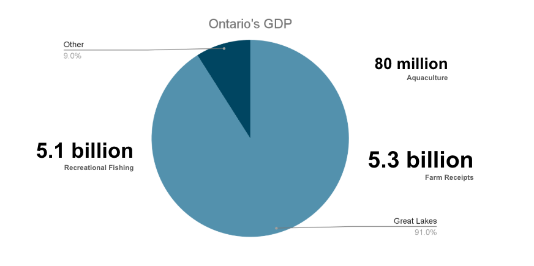
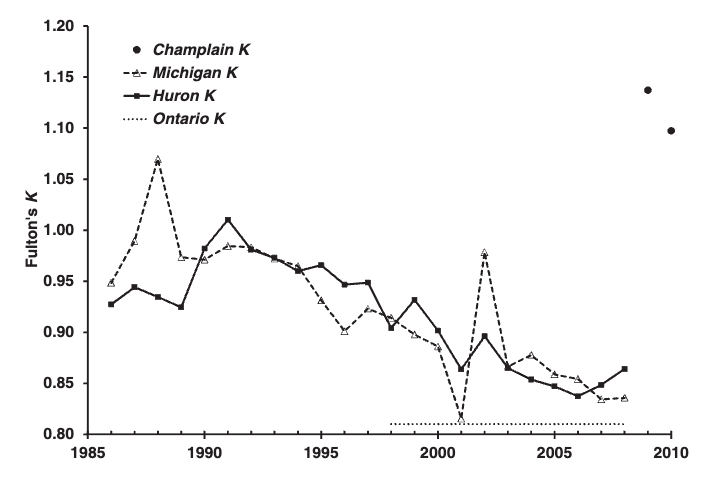
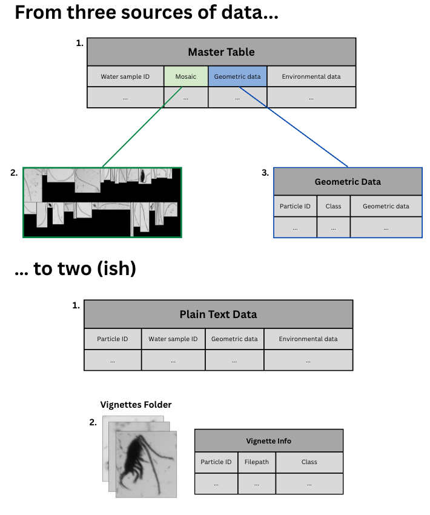

# Classifying Zooplankton in Lake Huron: A Collaborative Deep Learning Approach


## The Great Lakes Ecosystem
The Great Lakes and their surrounding ecosystem is the third largest regional economy in the world (Ontario Environment and Energy). In Ontario, the lakes are hugely important to the provincial economic landscape, contributing to 91% of the provincial GDP. 



*Great Lakes contributions to Ontario GDP*


The lakes are also immensely important to First Nations in the region, who have stewarded the land and water for generations. For the Saugeen Ojibway Nation, **lake whitefish** hold particular significance, playing a part in the creation story for all Anishinaabe and being an important food source for the community since time immemorial (Bardwell, 2024; Parks Canada). Unfortunately, due to reasons not entirely known, Lake Whitefish populations have significantly declined over the last twenty years (Cunningham & Dunlop, 2023), with some scientists believing the fish could disappear from some lakes entirely within the next five years (Katz, 2025). 



*Decline in Body Condition of Lake Whitefish (Herbst & Marsden, 2013)*

In the Great Lakes system, zooplankton are the foundation of the food web, with all fish feeding only on zooplankton at some point during their life cycles (US EPA, 2016). Given the sequential nature of the food chain, understanding downstream effects on larger organisms (like whitefish) begins with evaluating the basal organisms. In freshwater ecosystems, this involves understanding the variety and density of zooplankton populations. Given the economic importance of the Great Lakes ecosystem and the responsibility to protect whitefish, the provincial government requires updated tools to automatically classify and enumerate zooplankton organisms. 

## The Data

The Ministry provided three sources of data for this project, two plain-text datasets and a folder of images. The Master Table forms the base of this system, as each row represents a different water sample and the environmental information that is common to every particle in that sample. The Master Table also provides the filepathsfor the sample's mosaic, which is a grid of images of individual particles, as well as the table of geometric information for each particle in the sample. Due to computational constraints, 100 rows (100 water samples) from Lake Huron were randomly sampled from the Master table, and associated Mosaics and geometric data was obtained. This reduced dataset was used for model development. 

This random sample was then condensed into two datasets, one plain-text table and a folder of images. The plain-text dataset was merged such that each row represents a particle, the geometric data associated with that particle, and the environmental data associated with that particle's water sample. The Mosaics were split into individual vignettes (particle images), and a table was created to store the filepath, particle ID, and class of each vignette. 





# Classifying Zooplankton in Lake Huron
A machine learning project to classify zooplankton in Lake Huron using image and plain-text data. Data provided by Ontario Ministry of Natural Resources (MNR). 

The methods used in this project were informed by [Collaborative Deep Learning Models to Handle
Class Imbalance in FlowCam Plankton Imagery](https://ieeexplore.ieee.org/stamp/stamp.jsp?tp=&arnumber=9187202) by Kerr et al. (2020). While the authors used RGB plankton imagery from the English Channel, the overall data structure is very similar to that provided by the MNR. Therefore, a **collaborative deep learning approach** was used to classify the Lake Huron zooplankton data. 


## Table of Contents
- [Data](#data)
- [Frameworks](#frameworks)
- [Installation](#installation)
- [Usage](#usage)
- [Credits](#credits)


## Data
Data from this project is provided by the MNR. There is both plain-text data and image data for each water sample. 

Due to memory limitations on Github, not all data necessary for the project could be uploaded to this repository. Instructions for manual download described in [Installation](#installation).

## Frameworks
This project was developed with Tensorflow, Keras, and Sci-kit Learn. 


## Installation
1. Clone the repository in your terminal:
```bash
 git clone https://github.com/alauzon13/ZooplanktonGit/
```
2. Download data from Onedrive: 

From [Onedrive](https://utoronto-my.sharepoint.com/:f:/g/personal/vianey_leosbarajas_utoronto_ca/ElpxgGCqDHtJjFml4UJnD_QBPH7a3ijH_NCV-btbCNvbbw?e=qG1M9a), download the HURON_OverlapTiffsWithPP folder, including the HURONOverlap_csv sub-folder. Access may be required. Email adele.lauzon@mail.utoronto.ca with any questions about data access.

## Usage   
The full project pipeline is outlined in the notebook [FullPipeline.ipynb](https://github.com/alauzon13/ZooplanktonGit/blob/main/FullPipeline.ipynb). For a more readable version with trimmed outputs, see [FullPipeline_trimmed.ipynb](https://github.com/alauzon13/ZooplanktonGit/blob/main/FullPipeline_trimmed.ipynb). This is what was used to train and test the full models. Because the models take up to 3 hours to converge, a Mini Example was also created to provide an easier way to interact with the project. The notebook and necessary files for this are in MiniExample. 

## Credits 

This project was completed with support from professor [Dr. Vianey Leos Barajas](https://www.statistics.utoronto.ca/people/directories/all-faculty/vianey-leos-barajas) and post-doctoral fellow [Dr. Sofia Ruiz Suarez](https://www.statistics.utoronto.ca/people/directories/postdoctoral-fellows/sofia-ruiz-suarez). 


