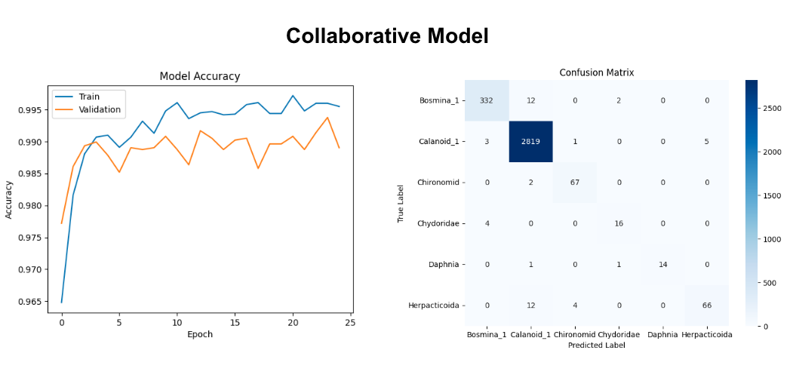

# Classifying Zooplankton in Lake Huron: A Collaborative Deep Learning Approach

## The Great Lakes Ecosystem
The Great Lakes and their surrounding ecosystem is the third largest regional economy in the world (Ontario Environment and Energy). In Ontario, the lakes are hugely important to the provincial economic landscape, contributing to 91% of the provincial GDP. 

*Great Lakes contributions to Ontario GDP*

The lakes are also immensely important to First Nations in the region, who have stewarded the land and water for generations. For the Saugeen Ojibway Nation, **lake whitefish** hold particular significance, playing a part in the creation story for all Anishinaabe and being an important food source for the community since time immemorial (Bardwell, 2024; Parks Canada). Unfortunately, due to reasons not entirely known, Lake Whitefish populations have significantly declined over the last twenty years (Cunningham & Dunlop, 2023), with some scientists believing the fish could disappear from some lakes entirely within the next five years (Katz, 2025). 

*Decline in Body Condition of Lake Whitefish (Herbst & Marsden, 2013)*

In the Great Lakes system, zooplankton are the foundation of the food web, with all fish feeding only on zooplankton at some point during their life cycles (US EPA, 2016). Given the sequential nature of the food chain, understanding downstream effects on larger organisms (like whitefish) begins with evaluating the basal organisms. In freshwater ecosystems, this involves understanding the variety and density of zooplankton populations. Given the economic importance of the Great Lakes ecosystem and the responsibility to protect whitefish, the provincial government requires updated tools to automatically classify and enumerate zooplankton organisms. 

## The Data

The Ministry provided three sources of data for this project, two plain-text datasets and a folder of images. The Master Table forms the base of this system, as each row represents a different water sample and the environmental information that is common to every particle in that sample. The Master Table also provides the filepathsfor the sample's mosaic, which is a grid of images of individual particles, as well as the table of geometric information for each particle in the sample. Due to computational constraints, 100 rows (100 water samples) from Lake Huron were randomly sampled from the Master table, and associated Mosaics and geometric data was obtained. This reduced dataset was used for model development. 

This random sample was then condensed into two datasets, one plain-text table and a folder of images. The plain-text dataset was merged such that each row represents a particle, the geometric data associated with that particle, and the environmental data associated with that particle's water sample. The Mosaics were split into individual vignettes (particle images), and a table was created to store the filepath, particle ID, and class of each vignette. 

Due to some classes being much more populous than others, oversampling and image augmentation were implemented. Oversampling is simply sampling with replacement from underrepresented classes to increase their presence, whereas image augmentation involves creating copies of the minority class images with random combinations of flips, stretches, and shifts applied. 

## The Model Setup

Much of the existing research around plankton classification separately analyzes images and text data. Class predictions for plain-text data can be found using multi-layer perceptrons (MLPs) or logistic regression, whereas image data is often modeled using convolutional neural networks (CNNs). It's been shown that separately analyzing the two data types produces models that underperform on less populous classes, even when oversampling and image augmentation have been applied. 

A **collaborative deep-learning** approach was used to develop the prediction algorithm, where models that are first trained individually on identical training sets are combined, outputs are averaged and a single class prediction -- using both the image and text data -- is produced. Kerr et al. (2020) first applied this method to plankton classification using samples from the English Channel. The authors propose that training different model architectures on identical training sets allows the ensemble to learn different methods and patterns, ultimately yielding higher accuracy measures overall as well as for minority classes. 

### MLP

Multilayer perceptrons (MLPs) can be thought of as the most foundational form of a neural network. In general, the neural network is designed to resemble a human brain in which groups of neurons are organized hierarchically in layers (Kerr et al., 2020). Data is input to the network (analogous to a “signal” in a brain), and certain neurons are activated that pass on the data to all connected neurons in the following layers. 

In an MLP, a one-dimensional array of data (in this case, the merged plain-text data) is passed through the network. In general, a single particle’s text data is about 440 times smaller than its vignette (Kerr et al., 2020), resulting in much shorter training times. As such, the MLP was able to be trained from scratch. Due to the rapid training speed of this model, a grid search for model configurations was performed. Following the work of Kerr and colleagues, all combinations of hidden layers (1-5) and neurons per layer (256, 512, 1024, and 2048) were explored. Further, a dropout layer was included to prevent overfitting, which randomly deactivates a ratio of neurons (0.5) from the previous layer for each training step.

### CNN

If a neural network is conceptualized as a brain, convolutional neural networks can be thought of as adding a visual cortex to this model (Kerr et al., 2020). Unlike MLPs or more simple neural networks, CNNs involve convolutional filters that slide across an image, learning localized patterns, and creating new feature spaces or maps. These new feature maps are also images, which themselves can be processed by additional convolutional layers, allowing the network to have any number of layers which lead to increasingly abstract representations. As new data is fed through the network, weights and biases of neurons are learned and updated. At a high level, the goal of a CNN is to learn the filter values necessary for each convolutional function (layer) such that the network learns to extract important features that allow accurate class prediction. 

Building a convolutional neural network from scratch requires significant computational resources and an abundance of training data. Given the limitations of this project, transfer learning was employed. Transfer learning involves initializing, re-training, and reconfiguring pre-trained models, where you begin with learned weights and biases and tune based on your particular dataset. Replicating the work of Bonin-Font et al. (2024), the EfficientNetv2 B3 model from TensorFlow was used, as the authors found that it performed well on plankton classification problems. Even with transfer learning, computational limitations did not allow for the same sort of grid search performed for the MLP. 

### Collaborative Model

To construct the collaborative model, both the CNN and MLP are loaded with trained weights. Weights are frozen when loaded into collaboration, and the output softmax (final) layer for each model is removed. In its place, the output just before the softmax layer for each model is connected to a new concatenated layer. Then, this layer is connected to a new fully connected layer with 512 neurons. This new layer acts as a new function for the collaborative model to learn how the MLP and CNN should each contribute to the final prediction. Finally, a new softmax layer was added, and the same training and validation data is used to learn the weights between the concatenated and fully connected layer.

## Results 

Both the MLP and CNN produced high accuracy rates (>95%) at the end of the 25 training epochs. Due to computational constraints, training beyond 25 epochs was not possible. 

A test set was held out during training, meaning there was a subset of the data which the model never saw during the training process. By evaulating model performance on this unseen data, we can understand whether our training accuracy was due to overfitting, or if the model was truly learning patterns and relationships present in the population. 

On the test data, the final collaborative model displayed 98% accuracy. As this collaborative approach was chosen in hopes of improved performance on classifying minority classes, missclassifications were investigated -- highlighted in the confusion matrix above. Any off-diagonal elements would indicate misclassifications. Overall, misclassifications were fairly minimal. For chydoridae, only 3 instances were misclassifed in the test set, and Daphnia had no misclassifications. 

## Discussion

Though this project was conducted using a small sample from the original dataset, it provides strong evidence for a collaborative learning approach to zooplankton classification. Future work could explore CNN architectures specifically designed for greyscale vignettes, as the chosen architecture was originally built for colored images. If resources permit, applying this framework to the entire dataset would provide a more robust understanding of how a collaborative approach performs on minority classes. 

 ## Citations
Bardwell, N. (2024). From Waters to Table: The Story of the Great Lakes Whitefish. Native News Online, https://nativenewsonline.net/sovereignty/from-waters-to-table-the-story-of-the-great-lakes-whitefish

Bonin-Font, F., Buenvaron, G., Kane, M., & Tuval, I. (2024). Microplankton Discrimination in FlowCAM Images Using Deep Learning: Proceedings of the 19th International Joint Conference on Computer Vision, Imaging and Computer Graphics Theory and Applications, 606–613. https://doi.org/10.5220/0012460200003660

Cunningham, K. E., & Dunlop, E. S. (2023). Declines in lake whitefish larval densities after dreissenid mussel establishment in Lake Huron. Journal of Great Lakes Research, 49(2), 491-505. https://doi.org/10.1016/j.jglr.2022.12.015.

Garcia-Hernandez, J. A., & Brouwer, R. (2020). A multiregional input–output optimization model to assess impacts of water supply disruptions under climate change on the Great Lakes economy. Economic Systems Research. DOI: 10.1080/09535314.2020.1805414

Hughes, C. (2022). Transfer Learning on Greyscale Images: How to Fine-Tune Pretrained Models on Black-and-White Datasets. Medium. https://medium.com/data-science/transfer-learning-on-greyscale-images-how-to-fine-tune-pretrained-models-on-black-and-white-9a5150755c7a 

Katz, E. (2025). ‘A crisis’: Lake whitefish survey paints an even more dire picture. Detroit Public Radio. https://wdet.org/2025/01/20/a-crisis-lake-whitefish-survey-paints-an-even-more-dire-picture

Kerr, T., Clark, J. R., Fileman, E. S., Widdicombe, C. E., & Pugeault, N. (2020). Collaborative Deep Learning Models to Handle Class Imbalance in FlowCam Plankton Imagery. IEEE Access, 8, 170013–170032. IEEE Access. https://doi.org/10.1109/ACCESS.2020.3022242

Mirasbekov, Y., Zhumakhanova, A., Zhantuyakova, A., Sarkytbayev, K., Malashenkov, D. V., Baishulakova, A., Dashkova, V., Davidson, T. A., Vorobjev, I. A., Jeppesen, E., & Barteneva, N. S. (2021). Semi-automated classification of colonial Microcystis by FlowCAM imaging flow cytometry in mesocosm experiment reveals high heterogeneity during seasonal bloom. Scientific Reports, 11(1), 9377. https://doi.org/10.1038/s41598-021-88661-2

Ontario Environment and Energy. (n.d.). Protecting the Great Lakes. ontario.ca. https://www.ontario.ca/page/protecting-great-lakes

Parks Canada Agency, Government of Canada (2024, October 18). Together with giigoonyag. Fathom Five National Marine Park. https://parks.canada.ca/amnc-nmca/on/fathomfive/nature/twg

US EPA, R. 05. (2016, January 26). Great Lakes Zooplankton Monitoring (Great Lakes) [Collections and Lists]. https://www.epa.gov/great-lakes-monitoring/great-lakes-zooplankton-monitoring
